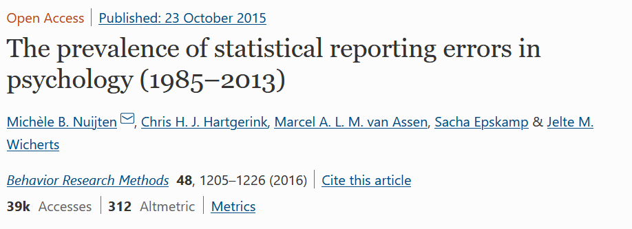
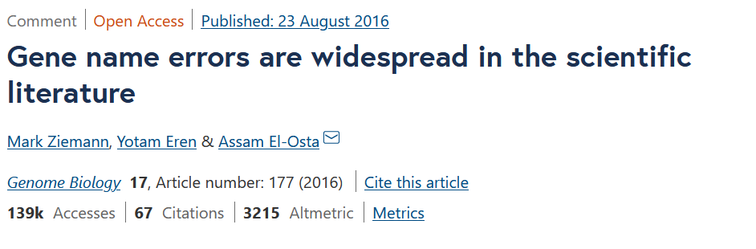
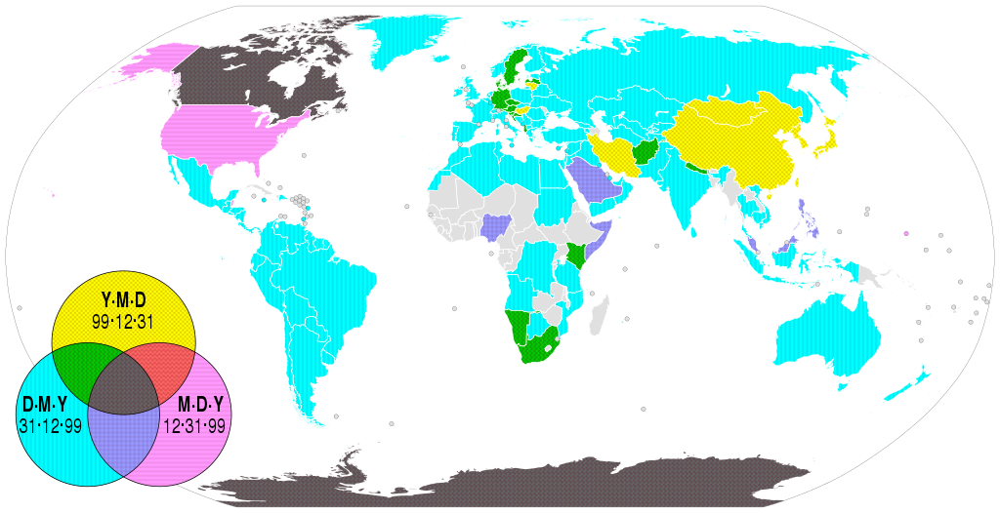
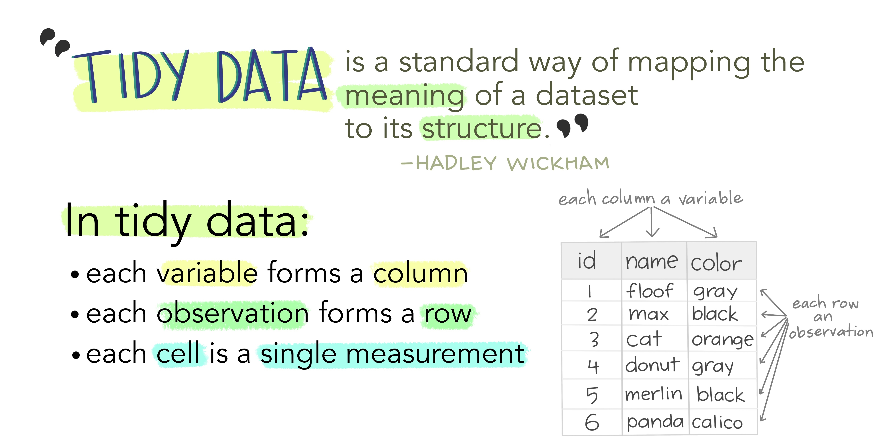
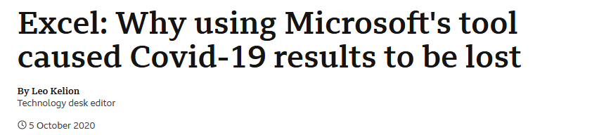
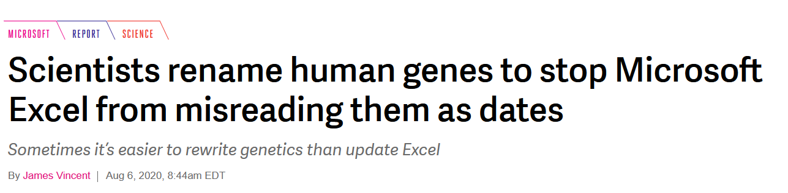

```{r setup, include=FALSE}
knitr::opts_chunk$set(echo = FALSE)
library(knitr)
library(RefManageR)
library(bibtex)

BibOptions(check.entries = FALSE,
           bib.style = "authoryear",
           cite.style = "alphabetic",
           style = "markdown",
           hyperlink = FALSE,
           dashed = FALSE)
bib <- ReadBib("./bibliography.bib", check = FALSE)

library(here)
library(readxl)
library(magrittr)
library(kableExtra)
library(tidyr)
library(dplyr)
library(lubridate)
```


```{r xaringan-themer, include=FALSE, warning=FALSE}
# uses my fork of the xaringanthemer package to left-align code chunks by default
#devtools::install_github("bbartholdy/xaringanthemer") 
library(xaringanthemer)
style_duo(
  primary_color = "#1F4257",
  secondary_color = "#F97B64",
  text_bold_color = "#F97B64", 
  code_inline_color = "#F97B64",
  text_font_size = "1.3rem",
  footnote_font_size = "0.7em",
  footnote_position_bottom = "25px",
  table_row_even_background_color = "#1F4257",
  header_font_google = google_font("Josefin Sans"),
  text_font_google   = google_font("Lato", "300", "700", "300i"),
  code_font_google   = google_font("Fira Mono")
)
```

# Hi, I'm Eirini `r emo::ji("wave")`

### `r emo::ji("woman_student")` PhD Candidate @Max Planck Institute for Psycholinguistics
- worked with lots of tabular data with observations from experiments with human participants
- got interested in open science and reproducibility

--

###`r emo::ji("briefcase")` Trainer on Research Data Management @TU Delft and 4TU.ResearchData
- train researchers and data supporters on good research data management practice

---

# Session outline
- Reproducibility & the FAIR principles
  - What is reproducibility and why is it important?
  - What are the FAIR principles?
- Data Carpentry: Data organisation for tabular data*
  - Good data entry practices
  - Formatting data tables in spreadsheets
  - Importing and exporting data

.footnote[The content presented in this part comes from the Data Carpentry lesson *[Data Organization in Spreadsheets for Ecologists](https://datacarpentry.org/spreadsheet-ecology-lesson/)* and is used under a [CC-BY licence](https://creativecommons.org/licenses/by/4.0/).]

---
class: center, middle, inverse

# Reproducibility & the FAIR principles

---

# What is reproducibility?

```{r reproducible-matrix, echo = FALSE}
include_graphics("images/reproducible-matrix.jpg")
```

<!-- TODO: figure out how to get the parenthetical citation working-->

.footnote[Image from [The Turing Way: A Handbook for Reproducible Data Science](https://the-turing-way.netlify.app/reproducible-research/overview/overview-definitions) `r NoCite(bib, "the_turing_way_community_2021")` (The Turing Way Community, 2021) used under a [CC-BY licence](https://creativecommons.org/licenses/by/4.0/).]

---

# Why is reproducibility important?

From an altruistic point of view, reproducibility is beneficial for the research community, and arguably society. 
--
In many cases, it is a minimum requirement for **verifying research**; when research can be verified, and by extension corrected, science is built on solid ground. 
--
Being able to reuse and build on available data and code saves time and resources, with the potential to speed up **innovation**. 

--

<br>
<br>
<br>

But reproducibility can also be beneficial for **individual researchers**!

---

# Reproducibility: benefits for individual researchers

<!-- TODO: figure out how to get the parenthetical citation working-->

There aren't only altruistic reasons to work reproducibly; it can be good for your career too!

Markowetz (2015) `r NoCite(bib, "markowetz_2015")` notes **five selfish** reasons to work reproducibly.


---

# Reason 1: reproducibility helps to avoid disaster

--

`r NoCite(bib, "nuijten_2016")`

```{r selfish-disaster-1, echo = FALSE}

```

--

- **1 in 2** examined papers had inconsistencies in the reported *p*-values

--

- **1 in 8** examined papers had inconsistencies large enough that they would affect the conclusions

---

# Reason 1: reproducibility helps to avoid disaster (cont'd)

--

`r NoCite(bib, "ziemann_2016")`

```{r selfish-disaster-2, echo = FALSE}

```

--

- **1 in 5** papers in genetics is thought to have an error because of the default settings in Microsoft Excel reading in gene names as dates

--

- *To be continued...*

---

# Reason 2: reproducibility makes it easier to write papers

- with literate programming it's easy to combine text and code

--

  - meaning you can call your results into your document directly. No more copy-pasting = **no more-copy pasting errors** `r emo::ji("sparkles")`
  
--

  - if you collect more data or change your data cleaning, you just need to rerun the analyses and all results will update
  
--

- working reproducibly often involves automation and/or good documentation, making it more likely **you'll actually know what you did** when it's time to write up `r emo::ji("woman_dancing_medium_light_skin_tone")`

---

# Reason 3: reproducibility helps reviewers see it your way

Sharing the underlying code and data makes it possible for the reviewers to:

--

- understand exactly how you cleaned and analysed the data

--

- try out different analyses themselves

--

- spot mistakes in your code`r emo::ji("eyes")`

---

# Reason 4: reproducibility enables continuity of your work

Good documentation of the data and code means:

--

- you'll be able to go to a project after a break (e.g., holidays, peer review)

--

- it's easier for others to pick up a project (important in long-term projects)

---

# Reason 5: reproducibility helps to build your reputation

Sharing and documenting your data and code well:

--

- helps you build a reputation as an honest and careful researcher.
This could be contributing to a **citation advantage** of about 25% for publications with linked data (Colavizza *et al.*, 2020). `r NoCite(bib, "colavizza_2020")`

--

- if there is ever a problem with one of your papers you can show you did everything in good faith

---

# Interim summary 1

Working reproducibly doesn't mean that there will definitely not be any mistakes in your work.
But it does make it easier to figure out what went wrong and, by extension, to fix it.

--

Working reproducibly can also make the paper writing and reviewing process easier and more productive.

--

And it can help others build on your work and build your reputation.

---

# FAIR and open data and code

Looking at this matrix again, it's clear that for reproducibility to be possible, it is necessary to be able to get a **copy of the data and code**.

<!-- TODO: figure out how to get the parenthetical citation working-->

Additionally, code and data need to be **Findable**, **Accessible**, **Interoperable**, and **Reusable**, or in short FAIR (`r NoCite(bib, "wilkinson_2016")`Wilkinson *et al.*, 2016).

```{r reproducible-matrix-2, echo = FALSE, out.height="75%", out.width ="75%"}
include_graphics("images/reproducible-matrix.jpg")
```

---

# Findable `r emo::ji("magnifying_glass_tilted_left")`

First people need to be able to find the data!

--

For data to be findable, they need to be described with **rich metadata**, or information about data.
These metadata can be generic (e.g. title, author name, keywords) or discipline specific.

--

Data also need to be assigned a **unique and persistent identifier**.
A commonly used identifier is the Digital Object Identifier (DOI).
Such identifiers make it easy to find data, but also to link them with other relevant information (e.g. a publication).

---

# Accessible `r emo::ji("unlocked")`

After people have found the data they need to be able to access them!

This could mean that the data are publicly available in a **data repository**, like 4TU.ResearchData.


--

### `r emo::ji("warning")` Personal data and other sensitive information

If you're working with personal data, classified data, or other sensitive information, you may need to keep the data restricted and require authentication or authorisation before others can access the data.

--

In those cases, **metadata should still be accessible**.

---

# Interoperable `r emo::ji("gear")`

Data often need to be integrated with other data.

This integration is easier when data make reference to other **relevant datasets**.

--

It's also important to make data available in **open file formats**, that anyone can open.

--

Using **controlled vocabularies** is also highly recommended, if these exist in your field.

---

# In how many different ways can you say "female"?*

![:col_row 

18-day pregnant females <br>
female (lactating) <br>
individual female <br>
worker caste (female) <br>
2 yr old female <br>
female (pregnant) <br>
sex: female <br>
400 yr. old female <br>
female (outbred) <br>
mare <br>
female (other) <br>
adult female <br>
female parent <br>
female (worker) <br>
female plant,
<b>femal</b> <br>
castrate female <br>
female with eggs <br>
ovigerous female <br>
3 female <br>
cf.female <br>
female worker <br>
oviparous sexual females <br>
female (phenotype) <br>
cystocarpic female <br>
gynoecious <br>
thelytoky <br>
dikaryon <br>
female virgin <br>
dioecious female,
femlale <br>
female (gynoecious) <br>
<b>remale</b> <br>
metafemale <br>
f <br>
<b>femele</b> <br>
sterile female <br>
famale <br>
normal female <br>
<b>femail</b> <br>
sf <br>
female <br>
females <br>
tetraploid female <br>
strictly female,
females only <br>
worker <br>
hexaploid female <br>
healthy female <br>
female (gynoecious) <br>
probably female <br>
female (note: this sample was originally provided as a "male" sample and labeled this way in the paper and original submission; however analyses carried out in the meantime clearly show that this sample stems from a female individual)

]

.footnote[Adapted from Silvester *et al.*, 2015. `r NoCite(bib, "silvester_2015")`]

---

# Dates

To avoid ambiguity, use the [RFC3339](https://datatracker.ietf.org/doc/html/rfc3339) standard: **YYYYMMDD** (or YYYY-MM-DD).

```{r date-formats, echo = FALSE, out.height="90%", out.width ="90%"}

```

.footnote[This [image](https://en.m.wikipedia.org/wiki/File:Date_format_by_country_revised.svg) was created by cmglee, Canuckguy and many others for [Wikimedia Commons](https://commons.wikimedia.org/wiki/Main_Page) and is used under a [CC-BY-SA licence](https://creativecommons.org/licenses/by-sa/4.0/)]


---

# Reusable `r emo::ji("recycle")`

Let's say people were able to find, access, and open your data.
Now for the last part!

--

To be able to reuse your work, people need to be able to *understand* it.
This means you need to provide good **documentation**:

--

- at a minimum, you should provide a **README** file where you describe what the project is about, how the files are organised and how to reproduce the project

---

# Example of a README file

.small[

**The Portal Project Teaching Database**

*Authors*: Morgan Ernest, James Brown, Thomas Valone, Ethan P. White

**General introduction**

The Portal Project Teaching Database is a simplified version of the [Portal Project Database](https://doi.org/10.5281/zenodo.6374066) designed for teaching. It provides a real world example of life-history, population, and ecological data, with sufficient complexity to teach many aspects of data analysis and management.

- Time coverage: Continuous data collection since 1977
- Site: 20 hectares split in 24 experimental plots in the Chihuahuan Desert (USA) 
- Species: rodents

**Purpose**

This database is not designed for research as it intentionally removes some of the real-world complexities. The original database is published at [Ecological Archives](http://esapubs.org/archive/ecol/E090/118/) and that version should be used for research purposes.

**Organisation**

The Python code used for converting the original database to this teach version is included as 'create_portal_teach_dataset.py'.

]

`r NoCite(bib, "ernest_2020")`

---

# Reusable `r emo::ji("recycle")`

Let's say people were able to find, access, and open your data.
Now for the last part!

To be able to reuse your work, people need to be able to *understand* it.
This means you need to provide good **documentation**:

- at a minimum, you should provide a **README** file where you describe what the project is about, how the files are organised and how to reproduce the project
- when working with tabular data, you should also provide a **data dictionary** where you explain what the different variables mean, the measurement units, how missingness is encoded etc.

---

# Some data

```{css, echo = FALSE}
/* I need a smaller font size */

.small { font-size: 70% }

```

.pull-left[

.small[

```{r read-data, echo = FALSE}
messy_data <- read_excel(here("data", "survey_data_spreadsheet_messy.xls"), sheet = 3, skip = 1)
messy_data %>% knitr::kable('html')
```

]

]

--

.pull-right[

### It's quite hard to make sense of data without context...

- what do the acronyms in `Species` stand for?
- what is the unit of measurement for `Weight`?

]

---

# Example of a data dictionary

- `Date collected`: the date the data were collected in YYYY-MM-DD format
- `Species`: a code for the species of the animal detected. See below for a table of what the codes stand for
- `Sex`: the sex of the animal detected, `M` for male and `F` for female
- `Weight`: the weight of the animal detected measured in grams 

Missing data are coded as `NA`.

| species code | scientific name     | common name                |
|--------------|:-------------------:|---------------------------:|
| PF           |  Perognathus flavus | Silky pocket mouse         |
| OT           |  Onychomys torridus | Southern grasshopper mouse |
| NA           |  Neotoma albigula   | White-throated woodrat     |

---

# Reusable (cont'd) `r emo::ji("recycle")`

Another crucial component of reusability is **usage licences**.
Just because something is shared online, doesn't mean anyone can use it.
That's because the creator* of the work holds the copyright to it.

.footnote[
*In fact, it is often your university or institute that holds the copyright to the work you created while working there.
]

--

So, you need to **tell people what they are allowed to do** with your data and code.
You do this by providing a usage licence.

--

Note that usage licences are different for data and for code:
- Commonly used licences for data, presentations, papers etc. are the [Creative Commons licences](https://creativecommons.org/about/cclicenses/)
- For code, you can check [a list of OSI-approved licences](https://choosealicense.com/licenses/)

---

# Don't panic!

```{r fair-principles, echo = FALSE, out.height="80%", out.width ="80%"}
include_graphics("images/fair-principles.jpg")
```

<!-- TODO: figure out how to get the parenthetical citation working-->

.footnote[This image was created by [Scriberia](https://www.scriberia.com/) for The Turing Way community and is used under a [CC-BY licence](https://creativecommons.org/licenses/by/4.0/). [DOI: 10.5281/zenodo.3332807](https://zenodo.org/record/5706310) `r NoCite(bib, "the_turing_way_community_2021_5706310")`]

---

# Interim summary 2

Making your data and code Findable, Accessible, Interoperable and Reusable can take you a long way towards making your work reproducible.

--

There are many things you need to do to make your work FAIR, but:
1. these things will benefit you
2. you don't have to start doing **everything** immediately
3. we're here to help `r emo::ji("handshake")` `r emo::ji("sparkles")` In this workshop you'll learn good practices for working with tabular data, how to generate and add metadata to your data, how to validate your data, and how to publish your data in a data repository.

--

So let's get started `r emo::ji("tada")`

---

class: center, middle, inverse

# Data Carpentry: Data organisation for tabular data

---

# Tabular data

.pull-left[

Most researchers work with **tabular data** for their research, so knowing how to organise this type of data well is fundamental.

<br>

Tabular data refers to "rectangular tables made up of *rows* and *columns*" (Wickham, 2014).
`r NoCite(bib, "wickham_2014")`
]

--

.pull-right[

.small[

```{r tabular-data, echo = FALSE}
messy_data %>% knitr::kable('html')
```

]

]

---

# Tidy data

A good framework for working with tabular data is that of **tidy data**. The concept of tidy data is borrowed from `R` and the `tidyverse` packages within it (Wickham, 2014).

```{r what-is-tidy-data, echo = FALSE, out.height="85%", out.width ="85%"}

```

.footnote[llustrations from the [Openscapes](https://www.openscapes.org/) blog [Tidy Data for reproducibility, efficiency, and collaboration](https://www.openscapes.org/blog/2020/10/12/tidy-data/) by Julia Lowndes and Allison Horst. `r NoCite(bib, "lowndes_2020")`]

---

# Tidy data

```{r tidy-data, echo = FALSE, out.height="100%", out.width ="100%"}
include_graphics("images/tidy-data-2.jpg")
```

.footnote[llustrations from the [Openscapes](https://www.openscapes.org/) blog [Tidy Data for reproducibility, efficiency, and collaboration](https://www.openscapes.org/blog/2020/10/12/tidy-data/) by Julia Lowndes and Allison Horst. `r NoCite(bib, "lowndes_2020")`]

---

# Why tidy data?

Using a consistent way to organise your data, e.g. following the tidy data structure, helps you be more **efficient** when working with your data.
That's because you can create (and reuse) tools that expect that kind of structure instead of starting from scratch every time.

<br>
<br>
<br>

--

Like `R`, `NumPy` and `pandas` can use vectorised processes that make working with large datasets more effcient and faster.
Placing variables in columns makes using vectorised processes easier.


---

# Example

.small[

.pull-left[

```{r long-data1, echo = FALSE}
messy_data %>% knitr::kable('html')
```

]

]

--

**Summary (long)**

.small[

.pull-right[

```{r long-data2, echo = FALSE, message = FALSE}
messy_data %>% 
  group_by(Species, Sex) %>%
  filter(!is.na(Weight)) %>% 
  summarise(`Mean weight` = round(mean(Weight), 2)) %>% 
  knitr::kable('html')
```


]

]

--

**Summary (wide)**

.small[

.pull-right[


```{r wide-data, echo = FALSE, message = FALSE}
messy_data %>% 
  group_by(Species, Sex) %>%
  filter(!is.na(Weight)) %>% 
  summarise(`Mean weight` = round(mean(Weight), 2)) %>%
  pivot_wider(names_from = Species,
              values_from = `Mean weight`) %>% 
  knitr::kable('html')
```

]

]

---

# `r emo::ji("warning")` Keep your data tidy from the start

How you collect your data will vary depending on your field and specific project:
- If you can control how the data are created, make sure you use the tidy data structure **from the beginning**.
- If you cannot control how the raw data are structured, wrangle them into the tidy format, ideally using a **scripted programming language**, like Python or R.

---

# Spreadsheet programmes (e.g. Microsoft Excel)

Researchers often use spreadsheet programmes like Microsoft Excel to work with their tabular data.


Although such programmes are good for some things, they aren't always appropriate...

--

```{r excel-issues-covid, echo = FALSE, out.height="80%", out.width ="80%"}

```

For example, when **16000** COVID cases went unreported in England when the old .xls file format ran out of rows. `r NoCite(bib, "kelion_2020")`

---

# Problems with Excel

### `r emo::ji("no_entry")` Data wrangling, visualisation & analysis

--

- easy to make mistakes (accidental deletions, misapplying formulas)

--

- not reproducible (including mistakes)

--

**Never edit your raw data in Excel!!!**

--

### `r emo::ji("warning")` Data entry

--

- data importing and exporting problems

--

- non machine-readable formatting

---

# Data importing and exporting problems

We've known since **2016** that many genetics papers (**1 in 5**) have mistakes because Microsoft Excel interprets gene names as dates.

--

```{r excel-issues-genes, echo = FALSE, out.height="100%", out.width ="100%"}

```

`r NoCite(bib, "vincent_2020")`

--

Also, for any **language scientists** out there working with a language that's not English, always use **UTF-8 text encoding**.

---

# Non machine-readable formatting

We often organise data the way we humans like to work, i.e. by relying on **context**.
That doesn't work for software like Python or R that we use to analyse data.
So we need to structure our data in a way computers can understand.

--

### Non machine-readable formatting includes:

--

- notes in the margin

--

- spatial layout of data

--

- field formatting

--

- using special characters and spaces

---

```{css, echo = FALSE}
/* I need a medium font size :) */

.medium { font-size: 90% }

```

# How to code missing values*

.medium[

| Null value | Problems               | Compatibility  | Recommendation |
|------------|:----------------------:|---------------:|---------------:|
| 0          | Looks like true 0      |                | Never use      |
| blank      | Could be an oversight  | R, Python, SQL | Best option    |
| 999, -999  | Not recognised as null |                | Avoid          |
| NA, na     | Can be abbreviation    | R              | Good option    |
| N/A        | Often incompatible     |                | Avoid          |
| NULL       | Data type issues       | SQL            | Good option    |
| None       | Data type issues       | Python         | Avoid          |
| No data    | Data type issues       |                | Avoid          |
| Missing    | Data type issues       |                | Avoid          |
| -, +, .    | Data type issues       |                | Avoid          |

]

.footnote[Adapted slightly from White *et al.* (2013) `r NoCite(bib, "white_2013")`]

---

# Summary: Tips for structuring tabular data

- Leave the raw data alone!
- Be consistent
- Put variables in columns
- Put observations in rows
- Put as little information as possible in a single cell
- Avoid spaces and special characters
- Use controlled vocabularies and standards (e.g. for dates)
- Create documentation (e.g. README and data dictionary)
- Think about how to code missing vales (and add that in the documentation!)
- Do not use formatting (colours, font, bolding)
- Use data validation to avoid errors (Frictionless Data framework)

---

# Exercise `r emo::ji("memo")`

- Download the [messy data](https://ndownloader.figshare.com/files/2252083)
- Open up the data in a spreadsheet programme
- Notice the two tabs: Two RAs conducted surveys, one in 2013 and one in 2014. They kept track of the data in their own way in the tabs 2013 and 2014 respectively. Now you're the person in charge of this project and you want to start analysing the data.
- You have 7 minutes to clean up as much of the dataset as you can.
- Once the 7 minutes are up:
  - take a screenshot of your cleaned dataset
  - add a comment with what confused or annoyed you the most
- Look at the posts of the other participants and give them a +1 if you like their solution/comment

`r countdown::countdown(minutes = 7, color_running_background  = "lightgreen", color_running_text = "black", color_finished_background = "red", color_finished_text =  "grey30")`

---

# Using open file formats

- **Accessible**: usable by multiple types of software that are freely available (e.g. note that Microsoft requires a paid licence)

--

- **Life expectancy**: open file formats are more suitable for long-terms preservation because they don't rely ona single software programme

--

- **Publishing**: data repositories, journals and funding agencies may have requirements for open file formats

--

- **Universal format**: interoperable format that produces the same results when it is imported by various software programmes, including plain text editors

---

# Which open file format? `r emo::ji("thinking")`

--

.pull-left[

### Comma delimited

comma-separated value files (.csv) are plain text files where the columns are separated by commas

`r emo::ji("thumbs_up_medium_light_skin_tone")` commonly used

`r emo::ji("thumbs_down_medium_light_skin_tone")` annoying when data itself contains commas

]

--

.pull-right[

### Tab delimited

tab-separated value files (.tsv) are plain text files where the columns are separated by tabs (\t)


`r emo::ji("thumbs_up_medium_light_skin_tone")` no confusion when data contains commas or semicolons

`r emo::ji("thumbs_down_medium_light_skin_tone")` not very commonly used (at least not yet)

]

---

# Exporting from Excel to .csv

1. From the top menu, select `File` and `Save as`
2. In the Format field select `CSV UTF-8 (Comma delimited) (.csv)` from the list
3. Double check the file name and the location where you want to save the data and hit `Save`

--

### My data contains commas!

Enclose the data fields with double quotes and double check that the file you are exporting can be read in correctly.

---

# Exporting from Excel to .tsv

1. From the top menu, select `File` and `Save as`
2. In the Format field select `Text (Tab delimited) (.txt)` from the list
3. Double check the file name and the location where you want to save the data and hit `Save`
4. Rename the file you just saved and change the extension from `.txt` to `.tsv`

---

# Resources

Metadata:
- [FAIRsharing.org](https://fairsharing.org/)
- [Digital Curation Centre](https://www.dcc.ac.uk/guidance/standards/metadata)
- [Research Data Alliance Metadata Directory](https://rd-alliance.github.io/metadata-directory/standards/)

Licences:
- [Creative Commons licences (for data)](https://creativecommons.org/about/cclicenses/)
- [OSI-approved licences (for code)](https://choosealicense.com/licenses/)


---

# References

.small[

```{r references-1, results='asis', echo=FALSE}
PrintBibliography(bib, start = 1, end = 8)
```

]

---

# References

.small[

```{r references-2, results='asis', echo=FALSE}
PrintBibliography(bib, start = 9, end = 14)
```

]
